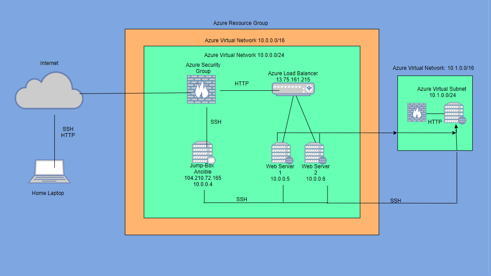

## Automated ELK Stack Deployment

The files in this repository were used to configure the network depicted below.

These files have been tested and used to generate a live ELK deployment on Azure. They can be used to either recreate the entire deployment pictured above. Alternatively, select portions of the playbook file may be used to install only certain pieces of it, such as Filebeat.

  install-elk.yml
  filebeat-install.yml
  my-playbook2.yml
  filebeat-config.yml

This document contains the following details:
- Description of the Topologu
- Access Policies
- ELK Configuration
  - Beats in Use
  - Machines Being Monitored
- How to Use the Ansible Build

### Description of the Topology

The main purpose of this network is to expose a load-balanced and monitored instance of DVWA, the D*mn Vulnerable Web Application.

Load balancing ensures that the application will be highly available, in addition to restricting access to the network.
  What aspect of security do load balancers protect? 
  load balancer defends an organization against distributed denial-of-service (DDoS) attacks.
  
  What is the advantage of a jump box?
  Jump box prevent the requirement of giving access to the rest of the network to outside world and and makes successful cyber-attacks on the server much more difficult.
  
Integrating an ELK server allows users to easily monitor the vulnerable VMs for changes to the logs and system traffic.

 What does Filebeat watch for?The Filebeat monitor the logfiles ,collect log events 
 What does Metricbeat record? Metrcibeat preodically collects metrics from the operating system and from services running on the server.

The configuration details of each machine may be found below.
_Note: Use the [Markdown Table Generator](http://www.tablesgenerator.com/markdown_tables) to add/remove values from the table_.

| Name      | Function                 | IP Address | Operating System |
|---------- |--------------------------|------------|------------------|
| Jump Box  | Gateway  | 10.0.0.1      | 10.0.0.4   | Linux            |
| Web-1     |Load-balanced web server  | 10.0.0.5   | Linux            |
| Web-2     |Load-balanced web server  | 10.0.0.6   | Linux            |
| ELK-Server|Collect log data          | 10.1.0.4   | Linux            |                  |

### Access Policies

The machines on the internal network are not exposed to the public Internet. 

Only the Jumpbox machine can accept connections from the Internet. Access to this machine is only allowed from the following IP addresses:
 Known selected IP addresses which need access to the Jumpbox. ex: home IP address.

Machines within the network can only be accessed by SSH.
 Which machine did you allow to access your ELK VM? What was its IP address? Jumpbox -IP 10.0.0.4 using SSH and port 5601 is accessible from home IP.

A summary of the access policies in place can be found in the table below.

| Name      | Publicly Accessible | Allowed IP Addresses |
|---------- |---------------------|----------------------|
| Jump Box  | No                  | Home IP              |
| Web-1     | No                  | 10.0.0.4             |
| Web-2     | No                  | 10.0.0.4             |
| ELK-Server| No                  | 10.0.0.4 & Home IP   |

### Elk Configuration

Ansible was used to automate configuration of the ELK machine. No configuration was performed manually, which is advantageous because...
What is the main advantage of automating configuration with Ansible?
  Easily configure multiple servers and enable automation

The playbook implements the following tasks:

In 3-5 bullets, explain the steps of the ELK installation play. E.g., install Docker; download image; etc._

1. Creat virtual machines and other network infrastructure like Network security group, load balancer elc..
2. Download and configure elk-docker container
3. Push the configuration to the web servers
4. Configure neccessary inbound rules

The following screenshot displays the result of running `docker ps` after successfully configuring the ELK instance.

### Target Machines & Beats
This ELK server is configured to monitor the following machines:
  10.0.0.5
  10.0.0.6

We have installed the following Beats on these machines:
Filebeat and Metricbeat

These Beats allow us to collect the following information from each machine:
In 1-2 sentences, explain what kind of data each beat collects, and provide 1 example of what you expect to see. E.g., `Winlogbeat` collects Windows logs, which we use to track user logon events, etc._

Filebeat collect the data about the file system and Metricbeat collects data about machine metrics and statistics(Examples of the data are CPU and RAM usage).

agent.hostname:Web-1 agent.id:28dad0fd-1fd8-43ea-bd9e-7c998f40e7e2 agent.ephemeral_id:d6fa5b0b-66e8-4f88-882b-d65fa5659c28 agent.type:filebeat agent.version:7.6.1 process.name:filebeat process.pid:1097 log.file.path:/var/log/syslog log.offset:575,198 fileset.name:syslog message:2020-11-28T10:13:07.472Z#011INFO#011[monitoring]#011log/log.go:145#011Non-zero metrics in the last 30s#011{"monitoring": {"metrics": {"beat":{"cpu":{"system":{"ticks":26220,"time":{"ms":5}},"total":{"ticks":235130,"time":{"ms":10},"value":235130},"user":{"ticks":208910,"time":{"ms":5}}},"handles":{"limit":{"hard":4096,"soft":1024},"open":10},"info":{"ephemeral_id":"d6fa5b0b-66e8-4f88-882b-d65fa5659c28","uptime":{"ms":625472421}},"memstats":{"gc_next":9903840,"memory_alloc":7898032,"memory_total":10609015112},"runtime":

### Using the Playbook
In order to use the playbook, you will need to have an Ansible control node already configured. Assuming you have such a control node provisioned: 

SSH into the control node and follow the steps below:
- Copy the config file to /etc/ansible/roles/files directory.
- Update the host file to include web servers ip addresses
  
- Run the playbook, and navigate to ____ to check that the installation worked as expected.

_TODO: Answer the following questions to fill in the blanks:_
- _Which file is the playbook? Where do you copy it?_
- _Which file do you update to make Ansible run the playbook on a specific machine? How do I specify which machine to install the ELK server on versus which to install Filebeat on?_
- _Which URL do you navigate to in order to check that the ELK server is running?

_As a **Bonus**, provide the specific commands the user will need to run to download the playbook, update the files, etc._
